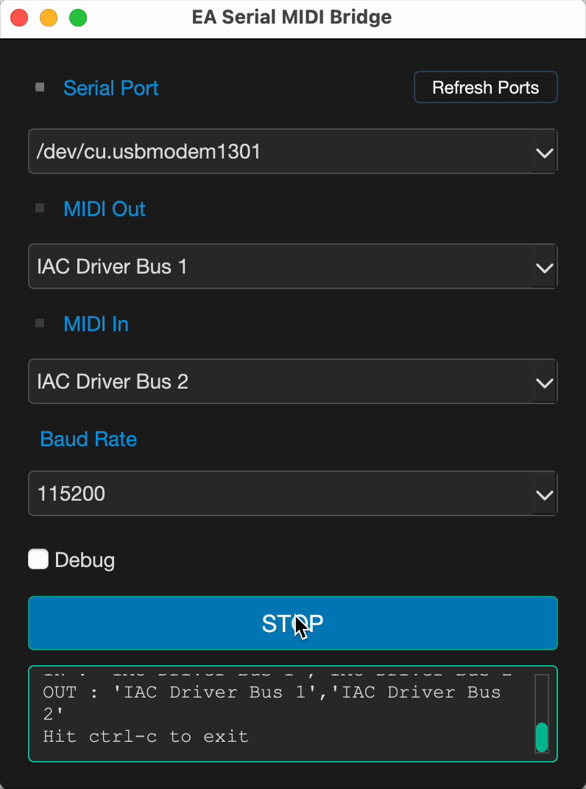

# EA Serial MIDI Bridge

EA Serial MIDI Bridge allows users to connect serial devices to MIDI applications, enabling seamless communication between hardware and software. It provides a graphical user interface (GUI) for easy configuration and monitoring of MIDI connections. You can use it to send and receive MIDI messages over a serial connection, making it ideal for musicians, developers, and hobbyists working with MIDI devices.

It works with any serial device that can send and receive MIDI messages, such as Arduino boards, ESP32, Raspberry Pi Pico, and other microcontrollers.

## Features

- **Serial to MIDI Bridge**: Convert serial data to MIDI messages and vice versa.
- **User-Friendly GUI**: Intuitive interface for configuring and monitoring connections.
- **Real-Time Monitoring**: View incoming and outgoing MIDI messages in real-time.
- **Customizable Settings**: Adjust serial port settings, MIDI channels, and message formats.
- **Cross-Platform**: Compatible with Windows, macOS, and Linux.

<div align="center">
  
</div>

This app is based on the [serialmidi](https://github.com/raspy135/serialmidi) repository, which provides a user-friendly way convert serial data to MIDI messages and vice versa.

## Project Structure

```plaintext
serialmidi-gui-app
├── src
│   ├── serialmidi.py        # Main logic for the Serial MIDI bridge
│   ├── gui.py               # GUI implementation using PyQt/PySide
│   └── assets
│       └── styles.qss       # Stylesheet for customizing the GUI appearance
├── requirements.txt         # List of dependencies
├── setup.py                 # Packaging configuration
└── README.md                # Project documentation
```

## Installation

To install the required dependencies, run the following command:

```bash
pip install -r requirements.txt
```

## Usage

To run the application, execute the following command:

```bash
python src/gui.py
```

Make sure to have your MIDI devices connected and specify the correct serial port in the GUI settings.

## Dependencies

This project requires the following Python packages:

- PyQt or PySide (for GUI)
- rtmidi (for MIDI handling)
- pyserial (for serial communication)

## Create a binary file

To create a binary file for the application, you can use `pyinstaller`.

First, install it if you haven't already:

```bash
pip install pyinstaller
```

Navigate to Your Project Directory
Change to the directory where your main script (gui.py) is located.

Then, run the following command in the terminal:

```bash
cd path/to/EA-serialmidi-bridge/src
```

### Run PyInstaller

Use PyInstaller to create a standalone executable. The `--windowed` option prevents a console window from appearing when you run the GUI application.

```bash
pyinstaller --windowed --name "gui" gui.py
```

IMPORTANT: `--onefile` option is recommended on Windows, but on macOS it may cause issues with the GUI. Therefore, we are not using it here.

This will create a `dist` folder containing the executable file for your application. You can find the binary file inside the `dist` folder.
You can now distribute this binary file to run the application without requiring users to install Python or any dependencies.

### Include Additional Files

The app uses external files like `styles.qss`. PyInstaller does not include these files by default.

To include them:

1. Edit the .spec file generated by PyInstaller (e.g., `git.spec`).

2. Add the `styles.qss` file to the datas section:

```bash
datas=[('assets/styles.qss', 'assets')],
```

- Missing Files: If the app crashes due to missing files, ensure they are included in the datas section of the .spec file.
- Hidden Imports: If the app crashes due to missing modules, add them to the hiddenimports list in the .spec file:

```bash
hiddenimports=['rtmidi._rtmidi'],
```

The a = Analisys section should look like this:

```bash
a = Analysis(
    ['gui.py'],
    pathex=['/Users/ezequielabregu/code/laboratory/serialmidi copy/serialmidi-gui-app/src'],
    binaries=[],
    datas=[('assets/styles.qss', 'assets')],
    hiddenimports=['rtmidi._rtmidi'],
    hookspath=[],
    ...
)
```

Change the name of the app in the .spec file to "EA Serial MIDI Bridge.app" and set the icon:

```bash
app = BUNDLE(
    coll,
    name='EA Serial MIDI Bridge.app',
    icon='assets/icon_filename.icns',
    bundle_identifier=None,
)
```

Save the .spec file.

### Windows build

On Windoes, you can use the `--onefile` option to create a single executable file. The command would look like this:

```bash
pyinstaller --onefile --windowed --name "gui" gui.py
```

On windows, you can also use the `--icon` option to set the icon for the executable:

```bash
pyinstaller --onefile --windowed --name "gui" --icon=assets/icon_filename.ico gui.py
```

The .spec file will look like this:

```plaintext
exe = EXE(
    pyz,
    a.scripts,
    a.binaries,
    a.datas,
    [],
    name='EA Serial MIDI Bridge',
    debug=False,
    bootloader_ignore_signals=False,
    strip=False,
    upx=True,
    upx_exclude=[],
    runtime_tmpdir=None,
    console=False,
    disable_windowed_traceback=False,
    argv_emulation=False,
    target_arch=None,
    codesign_identity=None,
    entitlements_file=None,
    icon=['assets\\trade.ico'],
)
```

### Rebuild the Binary

Change the .spec file name to gui.spec

```bash
pyinstaller gui.spec
```

### Optional: Code Signing and Notarization

If you plan to distribute the app to other macOS users, you may need to code-sign and notarize it to avoid Gatekeeper warnings:

#### Code Signing

```bash
codesign --deep --force --verify --sign "Developer ID Application: Your Name (TeamID)" dist/EASerialMIDIBridge/EASerialMIDIBridge.app
```

#### Notarization

Submit the app to Apple for notarization:

```bash
xcrun altool --notarize-app --primary-bundle-id "com.yourdomain.EASerialMIDIBridge" --username "your-apple-id" --password "app-specific-password" --file dist/EASerialMIDIBridge/EASerialMIDIBridge.app
```

## License

This project is licensed under the MIT License. See the LICENSE file for more details.

## Apendix

A classic symptom of updating the Qt GUI from a non-GUI thread.
In PyQt (and all Qt), all GUI updates must happen in the main (GUI) thread.
If you update the GUI (e.g., append to a QTextEdit) from a worker thread (like your MIDI or serial threads), you risk random crashes, including `segmentation faults`.

### How to Fix

1. Never call self.gui.log_message() directly from a worker thread.
Instead, use Qt signals to safely communicate from worker threads to the GUI thread.

2. Implement a Thread-Safe Logging Signal
Step 1: Add a signal to your GUI class:

```python
from PyQt6.QtCore import pyqtSignal

class SerialMIDIApp(QtWidgets.QWidget):
    log_signal = pyqtSignal(str)  # Add this line

    def __init__(self):
        super().__init__()
        self.initUI()
        self.serial_midi = None
        self.log_signal.connect(self.log_message)
```

Step 2: In your custom logging handler, emit the signal instead of calling the method directly:

```python
class GuiLogHandler(logging.Handler):
    def __init__(self, gui):
        super().__init__()
        self.gui = gui

    def emit(self, record):
        log_entry = self.format(record)
        # Use the signal to update the GUI safely
        self.gui.log_signal.emit(log_entry)
```

####  Why This Works

Qt signals/slots ensure that the slot (log_message) is always called in the main thread, even if the signal is emitted from a worker thread.
